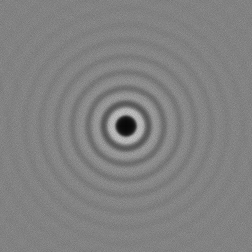

[](https://opensource.org/licenses/MIT)
[](https://en.wikipedia.org/wiki/C%2B%2B#Standardization)


[](https://codecov.io/github/thinks/poisson-disk-sampling)

# tph_poisson
This repository contains a [single file](include/thinks/tph_poisson.h), header-only, no-dependencies, C library for generating Poisson disk samplings in arbitrary dimensions. The implementation uses the techniques reported in the paper [Fast Poisson Disk Sampling in Arbitrary Dimensions](http://www.cs.ubc.ca/~rbridson/docs/bridson-siggraph07-poissondisk.pdf) published by [Robert Bridson](http://www.cs.ubc.ca/~rbridson/) in 2007.  

## Usage

Poisson disk sampling aims to generate a set of samples within a bounded region such that no two samples are closer than some user-specified radius to each other. Let's consider a simple [example](examples(simple_c.c)) written in C .

```C
// C11

#include <assert.h>/* assert */
#include <stddef.h>/* ptrdiff_t */
#include <stdint.h>/* UINT64_C, etc */
#include <stdio.h>/* printf */
#include <stdlib.h>/* EXIT_FAILURE, etc */

#define TPH_POISSON_IMPLEMENTATION
#include "thinks/tph_poisson.h"

int main(int argc, char *argv[])
{
  (void)argc;
  (void)argv;

  /* Configure arguments. */
  const tph_poisson_real bounds_min[2] = { (tph_poisson_real)-10, (tph_poisson_real)-10 };
  const tph_poisson_real bounds_max[2] = { (tph_poisson_real)10, (tph_poisson_real)10 };
  const tph_poisson_args args = { 
    .bounds_min = bounds_min,
    .bounds_max = bounds_max,
    .radius = (tph_poisson_real)3,
    .ndims = INT32_C(2),
    .max_sample_attempts = UINT32_C(30),
    .seed = UINT64_C(1981) };
  /* Using default allocator (libc malloc). */
  const tph_poisson_allocator *alloc = NULL;

  /* Create samples. */
  tph_poisson_sampling sampling = { .internal = NULL, .ndims = INT32_C(0), .nsamples = 0 };
  const int ret = tph_poisson_create(&args, alloc, &sampling);
  if (ret != TPH_POISSON_SUCCESS) {
    /* No need to destroy sampling here! */
    printf("Failed creating Poisson sampling! Error code: %d\n", ret);
    return EXIT_FAILURE;
  }

  /* Retrieve samples. */
  const tph_poisson_real *samples = tph_poisson_get_samples(&sampling);
  assert(samples != NULL);

  /* Print first and last sample positions. */
  printf("samples[%td] = ( %.3f, %.3f )\n", 
    (ptrdiff_t)0, 
    (double)samples[0], 
    (double)samples[1]);
  printf("...\n");
  printf("samples[%td] = ( %.3f, %.3f )\n\n",
    sampling.nsamples - 1,
    (double)samples[(sampling.nsamples - 1) * sampling.ndims],
    (double)samples[(sampling.nsamples - 1) * sampling.ndims + 1]);

  /* Free memory. */
  tph_poisson_destroy(&sampling);

  return EXIT_SUCCESS;
}
```

The code snippet above generates a set of points in the 2D range [-10, 10] separated by a distance (`radius`) of 3 units. The image below visualizes the results (generated using a simple [python script](python/poisson_plot.py)). On the right-hand side the radius has been plotted to illustrate the distance separating the points. Here it is "clear" that each circle contains only a single point.


There are two additional parameters of the `PoissonDiskSampling` function: `seed` and `max_sample_attempts`. The `seed` parameter is used to generate pseudo-random numbers in a deterministic way. Changing the seed gives slightly different patterns. The `max_sample_attempts` controls the number of attempts that are made at finding neighboring points for each sample. Increasing this number could lead to a more tightly packed sampling in some cases, at the cost of additional computation time. Both `seed` and `max_sample_attempts` have reasonable default values so they need not always be specified. The images below illustrate the effect of varying `seed` and `max_sample_attempts`. 


## Periodogram

Poisson disk sampling generates samples from a blue noise distribution. We can verify this by plotting the corresponding periodogram, noticing that there are minimal low frequency components (close to the center) and no concentrated spikes in energy.

The image below was generated using the code in one of the provided [examples](https://github.com/thinks/poisson-disk-sampling/blob/master/thinks/poisson_disk_sampling/examples/periodogram_example.cc) and is an average over 100 sampling patterns (original pixel resolution was 2048x2048).



# Building and installing

See the [BUILDING](BUILDING.md) document.

# Contributing

See the [CONTRIBUTING](CONTRIBUTING.md) document.

# Licensing

All code in this repository is released under the [MIT license](https://en.wikipedia.org/wiki/MIT_License).


## Cloning
In order to use the [single header file](https://github.com/thinks/poisson-disk-sampling/blob/master/thinks/poisson_disk_sampling/poisson_disk_sampling.h) in your project a simple clone is sufficient.
```
git clone https://github.com/thinks/poisson-disk-sampling.git
```
However, in order to build the tests and examples you need to initialize the submodules of this repository by cloning it recursively.
```
git clone --recursive https://github.com/thinks/poisson-disk-sampling.git
```
The easiest way to access the code is to use the provided CMake target. Assuming you cloned this repository (preferably as a submodule) in your `external` folder, just add the following lines of code to your CMakeLists.txt:

```CMake
// CMakeLists.txt
add_subdirectory(external/poisson-disk-sampling)
add_library(my_lib my_lib.cpp)
target_link_libraries(my_lib PUBLIC thinks::poisson_disk_sampling)
```

Giving you easy access to the functionality in your code.

```C++17
// my_lib.cpp
#include "thinks/poisson_disk_sampling/poisson_disk_sampling.h

// Use the thinks::PoissonDiskSampling(...) function in your code.
```

## Usage
Poisson disk sampling aims to generate a set of samples within a bounded region such that no two samples are closer than some user-specified radius. Let us first show a simple example.
```C++
// C++17

#include <array>
#include <vector>

#include "thinks/poisson_disk_sampling/poisson_disk_sampling.h"

auto Foo() -> std::vector<std::array<float, 2>> {
  // Input parameters.
  constexpr auto kRadius = 3.F;
  constexpr auto kXMin = std::array<float, 2>{{-10.F, -10.F}};
  constexpr auto kXMax = std::array<float, 2>{{10.F, 10.F}};

  // Samples returned as std::vector<std::array<float, 2>>.
  // Default seed and max sample attempts.
  return thinks::PoissonDiskSampling(kRadius, kXMin, kXMax);
}
```
The code snippet above generates a set of points in the 2D range [-10, 10] separated by a distance (`radius`) of 3 units. The image below visualizes the results (generated using a simple [python script](python/poisson_plot.py)). On the right-hand side the radius has been plotted to illustrate the distance separating the points. Here it is "clear" that each circle contains only a single point.


There are two additional parameters of the `PoissonDiskSampling` function: `seed` and `max_sample_attempts`. The `seed` parameter is used to generate pseudo-random numbers in a deterministic way. Changing the seed gives slightly different patterns. The `max_sample_attempts` controls the number of attempts that are made at finding neighboring points for each sample. Increasing this number could lead to a more tightly packed sampling in some cases, at the cost of additional computation time. Both `seed` and `max_sample_attempts` have reasonable default values so they need not always be specified. The images below illustrate the effect of varying `seed` and `max_sample_attempts`. 


