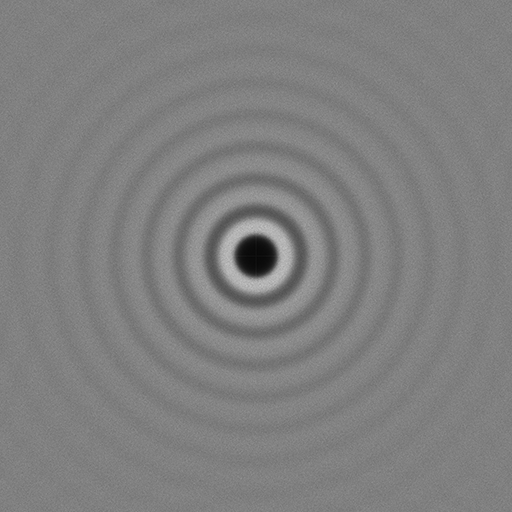

[](https://opensource.org/licenses/MIT)


[](https://codecov.io/github/thinks/poisson-disk-sampling)

[](https://en.wikipedia.org/wiki/C11_(C_standard_revision))
[](https://en.wikipedia.org/wiki/C%2B%2B17)

# tph_poisson
This repository contains a [single file](include/thinks/tph_poisson.h), header-only, no-dependencies, C library for generating Poisson disk samplings in arbitrary dimensions. The implementation uses the techniques reported in the paper [Fast Poisson Disk Sampling in Arbitrary Dimensions](http://www.cs.ubc.ca/~rbridson/docs/bridson-siggraph07-poissondisk.pdf) published by [Rook Bridson](http://www.cs.ubc.ca/~rbridson/) in 2007.  

Main features:
* Custom allocator interface for memory management at run-time.
* Possibility to override libc function at compile-time (using macros).

## Usage

Poisson disk sampling aims to generate a set of points within a bounded region such that no two points are closer than some user-specified radius to each other. Let's consider a simple [example](examples/src/simple.c) written in C.

```C
/* C11 */

#include <assert.h> /* assert */
#include <stddef.h> /* ptrdiff_t */
#include <stdint.h> /* UINT64_C, etc */
#include <stdio.h>  /* printf */
#include <stdlib.h> /* EXIT_FAILURE, etc */
#include <string.h> /* memset */

#define TPH_POISSON_IMPLEMENTATION
#include "thinks/tph_poisson.h"

static_assert(sizeof(tph_poisson_real) == sizeof(float), "");

int main(int argc, char *argv[])
{
  (void)argc;
  (void)argv;

  const tph_poisson_real bounds_min[2] = { 
    (tph_poisson_real)-10, (tph_poisson_real)-10 };
  const tph_poisson_real bounds_max[2] = { 
    (tph_poisson_real)10, (tph_poisson_real)10 };

  /* Configure arguments. */
  const tph_poisson_args args = { 
    .bounds_min = bounds_min,
    .bounds_max = bounds_max,
    .radius = (tph_poisson_real)3,
    .ndims = INT32_C(2),
    .max_sample_attempts = UINT32_C(30),
    .seed = UINT64_C(1981) };

  /* Using default allocator (libc malloc). */
  const tph_poisson_allocator *alloc = NULL;

  /* Initialize empty sampling. */
  tph_poisson_sampling sampling;
  memset(&sampling, 0, sizeof(tph_poisson_sampling));

  /* Populate sampling with points. */
  const int ret = tph_poisson_create(&args, alloc, &sampling);
  if (ret != TPH_POISSON_SUCCESS) {
    /* No need to destroy sampling here! */
    printf("Failed creating Poisson sampling! Error code: %d\n", ret);
    return EXIT_FAILURE;
  }

  /* Retrieve sampling points. */
  const tph_poisson_real *samples = tph_poisson_get_samples(&sampling);
  if (samples == NULL) {
    /* Shouldn't happen since we check the return value from tph_poisson_create! */
    printf("Bad samples!\n");
    tph_poisson_destroy(&sampling);
    return EXIT_FAILURE;
  }

  /* Print first and last sample positions. */
  assert(sampling.nsamples >= 2);
  printf("\n%s:\n"
         "samples[%td] = ( %.3f, %.3f )\n"
         "...\n"
         "samples[%td] = ( %.3f, %.3f )\n\n", 
    "simple (C)",
    (ptrdiff_t)0, 
    (double)samples[0], 
    (double)samples[1],
    (ptrdiff_t)(sampling.nsamples - 1),
    (double)samples[(sampling.nsamples - 1) * sampling.ndims],
    (double)samples[(sampling.nsamples - 1) * sampling.ndims + 1]);

  /* Free memory. */
  tph_poisson_destroy(&sampling);

  return EXIT_SUCCESS;
}
```

When using C++ it is possible to safely manage the memory allocated by the tph_poisson functions ([example](examples/src/simple.cpp)), as illustrated below:

```C++
// C++17

#include <array>      // std::array
#include <cassert>    // assert
#include <cstdint>    // UINT64_C, etc
#include <cstdio>     // std::printf
#include <functional> // std::function
#include <memory>     // std::unique_ptr

#define TPH_POISSON_IMPLEMENTATION
#include "thinks/tph_poisson.h"

static_assert(std::is_same_v<tph_poisson_real, float>);

int main(int /*argc*/, char * /*argv*/[])
{
  constexpr std::array<tph_poisson_real, 2> bounds_min{ 
    static_cast<tph_poisson_real>(-10), static_cast<tph_poisson_real>(-10) };
  constexpr std::array<tph_poisson_real, 2> bounds_max{ 
    static_cast<tph_poisson_real>(10),  static_cast<tph_poisson_real>(10) };

  // Configure arguments.
  tph_poisson_args args = {};
  args.radius = static_cast<tph_poisson_real>(3);
  args.ndims = INT32_C(2);
  args.bounds_min = bounds_min.data();
  args.bounds_max = bounds_max.data();
  args.max_sample_attempts = UINT32_C(30);
  args.seed = UINT64_C(1981);

  // Using default allocator (libc malloc).
  const tph_poisson_allocator *alloc = NULL;

  // Initialize empty sampling.
  using unique_poisson_ptr =
    std::unique_ptr<tph_poisson_sampling, std::function<void(tph_poisson_sampling *)>>;
  auto sampling = unique_poisson_ptr{ new tph_poisson_sampling{}, [](tph_poisson_sampling *s) {
                                       tph_poisson_destroy(s);
                                       delete s;
                                     } };

  // Populate sampling with points.                                     
  if (const int ret = tph_poisson_create(&args, alloc, sampling.get());
      ret != TPH_POISSON_SUCCESS) {
    std::printf("Failed creating Poisson sampling! Error code: %d\n", ret);
    return EXIT_FAILURE;
  };

  // Retrieve sampling points.
  const tph_poisson_real *samples = tph_poisson_get_samples(sampling.get());
  if (samples == nullptr) {
    // Shouldn't happen since we check the return value from tph_poisson_create!
    std::printf("Bad samples!\n");
    return EXIT_FAILURE;
  }

  // Print first and last sample positions.
  assert(sampling->nsamples >= 2);
  std::printf("\n%s:\n"
              "samples[%td] = ( %.3f, %.3f )\n"
              "...\n"
              "samples[%td] = ( %.3f, %.3f )\n\n", 
    "simple (Cpp)",
    static_cast<ptrdiff_t>(0), 
    static_cast<double>(samples[0]), 
    static_cast<double>(samples[1]),
    static_cast<ptrdiff_t>(sampling->nsamples - 1),
    static_cast<double>(samples[(sampling->nsamples - 1) * sampling->ndims]),
    static_cast<double>(samples[(sampling->nsamples - 1) * sampling->ndims + 1]));

  // tph_poisson_destroy is called by unique_poisson_ptr destructor.

  return EXIT_SUCCESS;
}
```

The code snippets above generate sets of points in the 2D (`ndims`) range [-10, 10] (`bounds_min` / `bounds_max`) separated by a distance (`radius`) of 3 units. The image below visualizes the results (generated using a simple [Python script](python/poisson_plot.py)). On the right-hand side the radius has been plotted to illustrate the distance separating the points. Here it is "clear" that each circle contains only a single point.


Besides radius and bounds, there are two additional arguments: `seed` and `max_sample_attempts`. The `seed` parameter is used to deterministically generate pseudo-random numbers. Changing the seed gives slightly different patterns. The `max_sample_attempts` controls the number of attempts that are made at finding neighboring points for each sample. Increasing this number typically leads to a more tightly packed sampling, at the cost of additional computation time. The images below illustrate the effects of varying `seed` and `max_sample_attempts`. 


## Periodogram

Poisson disk sampling generates samples from a blue noise distribution. We can verify this by plotting the corresponding [periodogram](https://en.wikipedia.org/wiki/Periodogram), noticing that there are minimal low frequency components (close to the center) and no concentrated spikes in energy.

The image below was generated using the provided [periodogram example](examples/src/periodogram.c) and is an average over 100 sampling patterns (original pixel resolution was 2048x2048).



# Building and installing

See the [BUILDING](BUILDING.md) document.

# Contributing

See the [CONTRIBUTING](CONTRIBUTING.md) document.

# Licensing

All code in this repository is released under the [MIT license](https://en.wikipedia.org/wiki/MIT_License).
